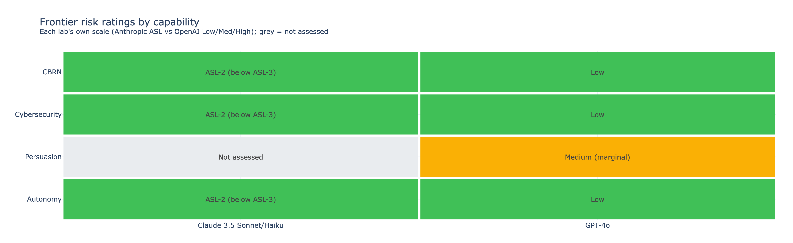
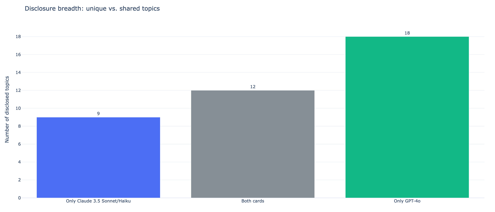
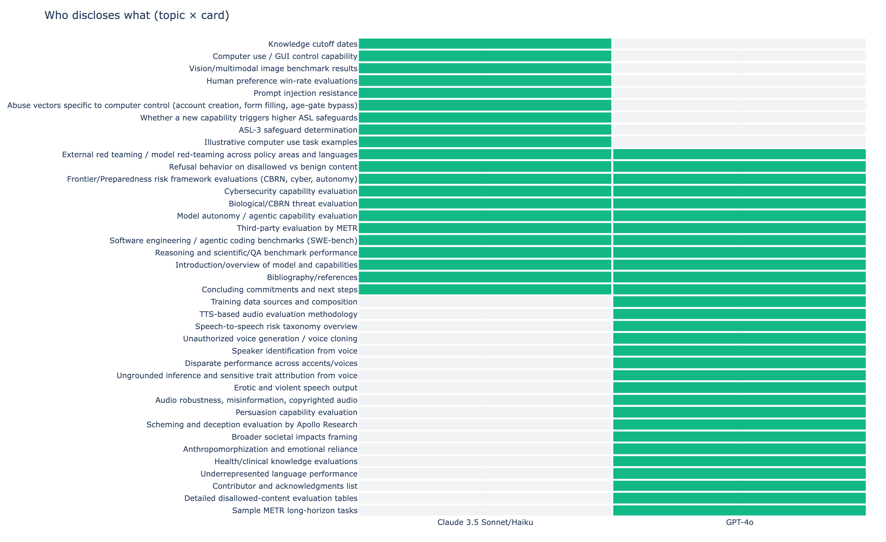

# AI System Card Disclosure Analysis

An LLM-driven pipeline that extracts and compares what frontier AI labs disclose in
their safety / system cards. First comparison: **Claude 3.5 Sonnet/Haiku** vs
**GPT-4o**, focused on frontier / dangerous-capability risk — CBRN, cybersecurity,
persuasion, and autonomy.

## Key findings

- Both labs rate **CBRN, cybersecurity, and autonomy** as low concern for these models
  (Claude: ASL-2, below the ASL-3 threshold; GPT-4o: Low across OpenAI's Preparedness
  Framework).
- The clearest divergence is **persuasion**: GPT-4o is rated **Medium** (marginal), while
  the Claude card **does not assess** persuasion as a frontier category.
- GPT-4o's card discloses more distinct topics (**17 unique vs 8**), largely because its
  native voice/omni modality introduces a whole class of disclosures (voice cloning,
  speaker identification, anthropomorphization) — partly also a format effect (see caveats).

## Figures

### Frontier risk ratings by capability


### Disclosure breadth — unique vs. shared topics


### Who discloses what (topic × card)


## How it works

A four-stage pipeline (`safety_card_batch.py`), human-in-the-loop:

1. **discover** — an LLM reads each card and lists every section it contains.
2. **compare** — sections are clustered into shared themes across cards.
3. **review** — a human confirms which dimensions to extract (extraction is **gated** on
   explicit confirmation).
4. **extract** — two passes: semantic overlap/unique detection, then per-card content
   extraction. Each field yields compact **key phrases** (for tables) plus full **detail**.

`visualize.py` builds the figures; `extract_risk_ratings.py` structures the risk levels.

## Repository layout

| Path | What |
|------|------|
| `safety_card_batch.py` | the pipeline (discover / compare / review / extract) |
| `visualize.py` | generates the Plotly figures |
| `extract_risk_ratings.py` | structures frontier-risk levels for the risk figure |
| `discoveries/` | per-card section inventories |
| `docs/figures/` | interactive (HTML) + web PNG figures |
| `output/` | high-res PNG + vector SVG figures |

## Running it

```bash
pip install -r requirements.txt
export ANTHROPIC_API_KEY=sk-ant-...

python safety_card_batch.py --mode discover --url <card-url> --id <name>
python safety_card_batch.py --mode compare
python safety_card_batch.py --mode review        # iterate on selections
python safety_card_batch.py --mode extract --confirm
python extract_risk_ratings.py
python visualize.py
```

## Caveats

- The Claude source is the **Claude 3.5 model card addendum (Oct 2024)**, which supplements
  the full Claude 3 Model Card; some Claude disclosures live in the base card and are not
  included here, which inflates GPT-4o's apparent breadth. A future version ingests the base
  card too.
- Overlap / unique matching is **LLM-semantic**, not exact string matching.
- This first version compares two cards; the raw comparison data and full side-by-side text
  report are added in a later version.
