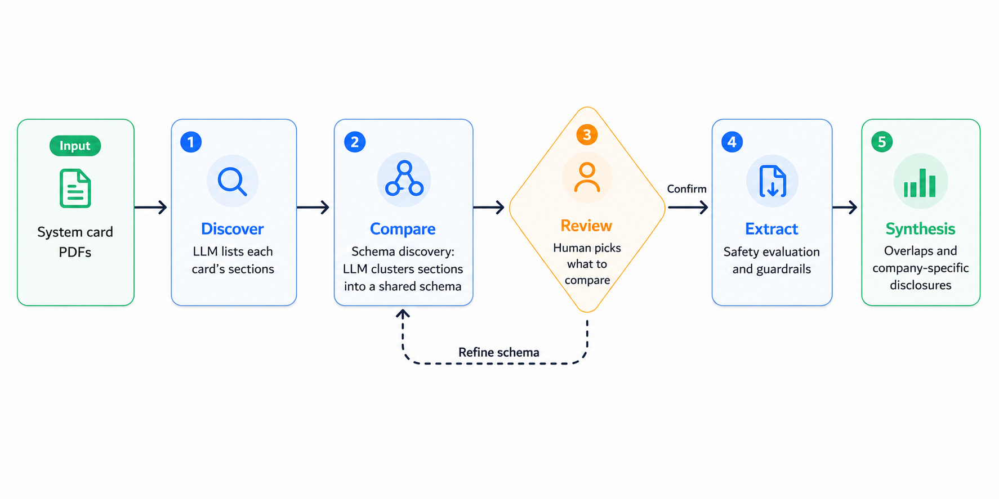

# Approach & notes

Frontier AI labs publish system cards and safety reports, but they use different taxonomies, evaluation frameworks, and reporting styles. This project explores whether AI-assisted workflows can help humans systematically compare these disclosures while keeping humans responsible for validation. Additionally, this study is meant to facilitate analysis of similarities and differences in disclosures.

## Approach

We designed a multi-step iterative approach. The approach first discovers the major themes or taxonomies adopted in the cards. This is followed by an LLM-based semantic clustering of discovered themes to normalize or compare safety cards across shared analytical themes that use varying descriptive language. The human then iteratively provides feedback on the analytical theme, defining the scope of the analysis. This step can include modification, expansion, and correction of the clustering. By anchoring on the shared schema, the workflow analyzes the disclosed information across companies for overlaps and differences. This is a prototype, and future updates will expand this work.

## Lessons learned and challenges

**LLM-as-an-assistant.** In analyzing this process, we started with older, smaller models that have relatively compact (and less interesting) safety cards so that they fit within a relatively small 'max-token' limit while creating the prototype. The multi-step approach was human-designed. LLM assistance was used in implementation. Even though the overarching goal was shared to have the model generate a high-level plan, there were several instances when the generated code would deviate, omit details, and fail to follow instructions, whether human-provided or an LLM-generated, human-approved refinement. We also noted instances where the LLM deviated from specified human preferences related to the workflow, which needed repetition. The LLM-generated plan was not comprehensive enough to design and complete all steps — but, being an exploratory project, a lot of details and decisions surfaced while building the workflow that needed human inputs for steering, and for planned future versions we expect the workflow to need additional updates and refinements. It is possible that if the project were more quantifiable or targeted, or in later versions of the project, the LLM-generated plans may be more detailed and implementable, building on the existing v0 codebase and having learned from failures and human design choices.

**Safety cards.** Safety cards follow varying taxonomies, frameworks, terminologies, and decision thresholds. This also makes extraction and comparison challenging, necessitating the semantic clustering step. Our current workflow used a simple prompt-based LLM as a semantic clusterer, and refinements to this step can improve comparison. Analyzing a single model family or releases from a company alone may be more straightforward due to less variability in terminology. This also points to the need for standards that identify necessary information for transparency, while establishing a common taxonomy for reporting.

**Ground truth.** In the exploratory phase of an open-ended study, the lack of quantifiable feedback made the AI-assisted implementation more nuanced and needed a human-in-the-loop for steering. Access to or feedback from model developers would be useful in improving model judgement around key information. If model developers could evaluate the derived analysis, an interesting comparison that could have been made is whether the information extracted on each axis matches or meets the key information the developer would have summarized.

## What worked well

**Implementation.** The multi-step approach was designed, reviewed, and steered by a human, but the implementation was AI-driven. Once the steps were detailed, the generated code closely matched the requirements (and sometimes needed course correction). This significantly reduced implementation time, with this first pass taking ~5-6 hours. I don't have a control set (how long this would take me to implement without AI assistance, just plain web access to debug errors) — likely several days.

**Semantic clustering and schema extraction across documents released from different companies, in the absence of standards.** Parsing information using company-specific terminology and clustering it to identify commonalities to create a schema was AI-driven and worked well. Given the size of the safety cards, this comparison is infeasible manually, requiring ML information extraction approaches. AI assistance facilitates this process but certainly has limitations. It is possible to improve the semantic analysis to produce a more comprehensive or targeted comparison.

## Future uses

1. In AI evaluation, transparency, and standards setting: use in assessing evaluations conducted and risk thresholds for various dangerous capabilities and safety guardrails added; analysis of capabilities over time; checking adherence to standards and the need for additional transparency.
2. AI-assisted transparency assessment: which disclosures most accurately capture information.
3. Embedded in evaluation: in more stable, robust future versions, a useful application would be for this workflow to observe logs of evaluation, guardrails, and decisions to auto-generate safety cards (with human supervision to oversee as necessary).
4. Targeted actor- or domain-specific summaries: auto-generate different versions of a safety card for a given model family.
